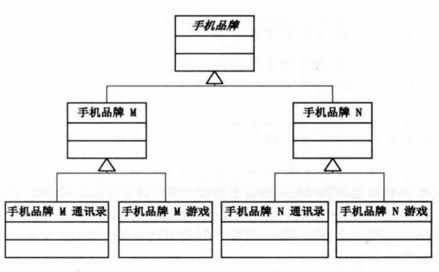
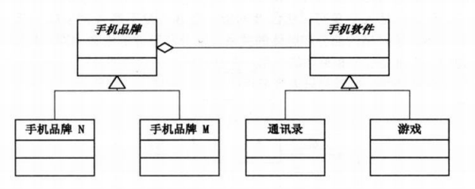

## 桥接模式

### 介绍

桥接适用于把抽象化与实现化解耦，使得二者可以独立变化。（结构型模式）
用来解决两个或者多个纬度的变化，使用桥接模式可以降低复杂度。将两个角色之间的继承关系改为聚合关系，这样两者可以独立的变化。

### 例子

就像大话设计模式中讲的一样，每个手机都有其对应的功能（软件），而这些功能在不同手机上可能不兼容，那么列出一个手机品牌和其对应的部分功能的结构图如下：

但是这样的话，不管要增加一个手机品牌还是要增加一个软件，操作都会很复杂。
因此用桥接模式把这这两个维度之间的继承关系改为聚合关系会使这个问题变得简单，聚合关系的结构图如下：


### DEMO
手机软件抽象类
```
package factory.pattern.bridge;

/**
 * Created by FK on 2017/7/26.
 */
public abstract class HandSetSoft {
    public abstract void run();
}
```
手机游戏
```
package factory.pattern.bridge;

/**
 * Created by FK on 2017/7/26.
 */
public class HandSetGame extends HandSetSoft {
    @Override
    public void run() {
        System.out.println("运行手机游戏");
    }
}
```
手机通讯录
```
package factory.pattern.bridge;

/**
 * Created by FK on 2017/7/26.
 */
public class HandSetAdressList extends HandSetSoft {
    @Override
    public void run() {
        System.out.println("运行手机通讯录");
    }
}
```
手机品牌
```
package factory.pattern.bridge;

/**
 * Created by FK on 2017/7/26.
 */
public abstract class HandSetBrand {
    HandSetSoft handSetSoft;

    public void setHandSetSoft(HandSetSoft handSetSoft){
        this.handSetSoft = handSetSoft;
    }

    public abstract void run();
}
```
手机品牌N
```
package factory.pattern.bridge;

/**
 * Created by FK on 2017/7/26.
 */
public class HandSetBrandN extends HandSetBrand {
    @Override
    public void run() {
        handSetSoft.run();
    }
}
```
手机品牌A
```
package factory.pattern.bridge;

/**
 * Created by FK on 2017/7/26.
 */
public class HandSetBrandA extends HandSetBrand {
    @Override
    public void run() {
        handSetSoft.run();
    }
}
```
测试类
```
package factory.pattern.bridge;

/**
 * Created by FK on 2017/7/26.
 */
public class Test {
    public static void main(String[] args) {
        HandSetBrand hb ;
        hb = new HandSetBrandA();
        hb.setHandSetSoft(new HandSetGame());
        hb.run();
        hb.setHandSetSoft(new HandSetAdressList());
        hb.run();
        hb = new HandSetBrandN();
        hb.setHandSetSoft(new HandSetGame());
        hb.run();
        hb.setHandSetSoft(new HandSetAdressList());
        hb.run();
    }
}
```