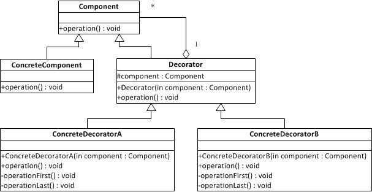

## 装饰器模式

### 介绍

装饰器模式允许向一个现有的对象添加新功能，同时又不改变其结构。（结构型模式）
这种形式在没有原类文件和使用继承的情况下动态的扩展了一个对象的功能。类的继承是在编译是时候增加的功能，而装饰器模式在运行时增加的功能

### 装饰器模式构成



Component : 组件对象接口，可以给这些对象动态添加职责

ConcreteComponent ： 具体的组件对象，实现了组件接口。这个对象通常是被装饰器修饰的原始对象，可以给这个对象添加职责。

Decorate : 所有装饰器的父类，需要定义一个与组件接口一直的接口（实现装饰器的复用），并持有component对象，这个对象就是被装饰的对象。如果不继承组件接口类，则只能为某个组件添加单一的功能，即装饰器对象不能在装饰其他的装饰器对象。

ConcreteDecorator：具体的装饰器类，实现具体要向被装饰对象添加的功能。用来装饰具体的组件对象或者另外一个具体的装饰器对象。
 
### DEMO
 
Component

```
package factory.pattern.Decorator;

/**
 * Created by FK on 2017/8/1.
 */
public interface Shape {
    void draw();
}
```
ConcreteComponent

```
package factory.pattern.Decorator;

/**
 * Created by FK on 2017/8/1.
 */
public class Circle implements Shape {
    @Override
    public void draw() {
        System.out.println("Shape : Circle");
    }
}

package factory.pattern.Decorator;

/**
 * Created by FK on 2017/8/1.
 */
public class Rectangle implements Shape {
    @Override
    public void draw() {
        System.out.println("Shape : Rectangle");
    }
}

```

Decorate

```
package factory.pattern.Decorator;

/**
 * Created by FK on 2017/8/1.
 */
public abstract class ShapeDecorator implements Shape {
    protected Shape decoratorShape;

    public ShapeDecorator(Shape decoratorShape) {
        this.decoratorShape = decoratorShape;
    }

    public void draw(){
        decoratorShape.draw();
    }

}
```

ConcreteDecorator

```
package factory.pattern.Decorator;

import java.util.ArrayList;
import java.util.List;

/**
 * Created by FK on 2017/8/1.
 */
public class RedShapeDecorator extends ShapeDecorator {
    public RedShapeDecorator(Shape decoratorShape) {
        super(decoratorShape);
    }

    @Override
    public void draw() {
        decoratorShape.draw();
        setRedBorder(decoratorShape);
    }

    public void setRedBorder(Shape redBorder) {
        System.out.println("Border Color : Red");
        List<String> list = new ArrayList<>();
    }
}
```

TEST

```
package factory.pattern.Decorator;

/**
 * Created by FK on 2017/8/1.
 */
public class DecoratorPatternDemo {
    public static void main(String[] args) {
        Shape shape = new Circle();
        Shape redCircle = new RedShapeDecorator(new Circle());
        Shape redRectangle = new RedShapeDecorator(new Rectangle());
        System.out.println("Circle with normal border");
        shape.draw();
        System.out.println("\nCircle of red border");
        redCircle.draw();

        System.out.println("\nRectangle of red border");
        redRectangle.draw();
    }
}
```