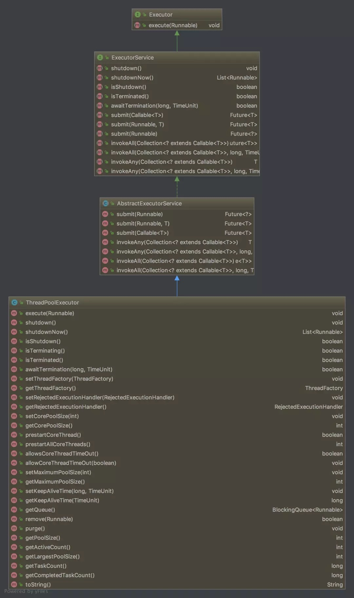

### 类继承的结构



Executor是最顶层的接口，定义了execute(Runnable runnable)方法。ExecutorService继承了Executor，继承了execute方法，还定义很多接口方法，例如shutdown、isTerminated、submit等方法。

在下面一层是AbstractExecutorService，这是一个抽象类，实现一些很有用的方法供子类使用。

ThreadPoolExecutor是我们线程池的实现。

### ThreadPoolExecutor

ThreadPoolExecutor实现了一个线程池需要的各个方法，它实现了任务提交、线程管理、监控等等方法。

我们还可以在它的基础上进行扩展，比如实现定时任务的类 ScheduledThreadPoolExecutor（用来在给定延时后执行异步任务或者周期性执行任务） 就继承自 ThreadPoolExecutor。

#### 构造函数参数

```
public ThreadPoolExecutor(int corePoolSize,
                          int maximumPoolSize,
                          long keepAliveTime,
                          TimeUnit unit,
                          BlockingQueue<Runnable> workQueue,
                          ThreadFactory threadFactory,
                          RejectedExecutionHandler handler) {
    if (corePoolSize < 0 ||
        maximumPoolSize <= 0 ||
        maximumPoolSize < corePoolSize ||
        keepAliveTime < 0)
        throw new IllegalArgumentException();
    if (workQueue == null || threadFactory == null || handler == null)
        throw new NullPointerException();
    this.acc = System.getSecurityManager() == null ?
            null :
            AccessController.getContext();
    this.corePoolSize = corePoolSize;
    this.maximumPoolSize = maximumPoolSize;
    this.workQueue = workQueue;
    this.keepAliveTime = unit.toNanos(keepAliveTime);
    this.threadFactory = threadFactory;
    this.handler = handler;
}
```

我们创建一个线程池参数最全的构造方法如上，这些是我们最关心的参数。

- corePoolSize 核心线程数
- maximumPoolSize 最大线程数
- keepAliveTime 空闲线程的存活时间
- unit 存活时间的单位
- workQueue 任务队列，BlockingQueue 接口的某个实现（常使用 ArrayBlockingQueue 和 LinkedBlockingQueue）。
- threadFactory 用于创建线程，一般都使用默认的（Executors.defaultThreadFactory()），我们可以通过它将我们的线程的名字设置得比较可读一些，如 Message-Thread-1， Message-Thread-2 类似这样。
- handler 拒绝策略

#### 状态流转

```
private final AtomicInteger ctl = new AtomicInteger(ctlOf(RUNNING, 0));
private static final int COUNT_BITS = Integer.SIZE - 3;
private static final int CAPACITY   = (1 << COUNT_BITS) - 1;

private static final int RUNNING    = -1 << COUNT_BITS;
private static final int SHUTDOWN   =  0 << COUNT_BITS;
private static final int STOP       =  1 << COUNT_BITS;
private static final int TIDYING    =  2 << COUNT_BITS;
private static final int TERMINATED =  3 << COUNT_BITS;
```

> COUNT_BITS 设置为 29(32-3)，前三位用于存放线程状态，后29位用于存放线程数
> CAPACITY = 2^29-1=536870911  即线程池的最大数量
> RUNNING  111 00000000000000000000000000000 接受新的任务，处理等待队列中的任务
> SHUTDOWN  000 00000000000000000000000000000 不接受新的任务提交，但是会继续处理等待队列中的任务
> STOP  001 00000000000000000000000000000 不接受新的任务提交，不再处理等待队列中的任务，中断正在执行任务的线程
> TIDYING  010 00000000000000000000000000000 所有的任务都销毁了,线程池的状态在转换为 TIDYING 状态时，会执行钩子方法 terminated()
> TERMINATED  011 00000000000000000000000000000 terminated() 方法结束后，线程池的状态就会变成这个

- RUNNING -> SHUTDOWN：当调用了 shutdown() 后，会发生这个状态转换，这也是最重要的
- (RUNNING or SHUTDOWN) -> STOP：当调用 shutdownNow() 后，会发生这个状态转换，这下要清楚 shutDown() 和 shutDownNow() 的区别了
- SHUTDOWN -> TIDYING：当任务队列和线程池都清空后，会由 SHUTDOWN 转换为 TIDYING
- STOP -> TIDYING：当任务队列清空后，发生这个转换
- TIDYING -> TERMINATED：这个前面说了，当 terminated() 方法结束后

#### Worker

```
private final class Worker
        extends AbstractQueuedSynchronizer
        implements Runnable
{
    private static final long serialVersionUID = 6138294804551838833L;

    final Thread thread;
    Runnable firstTask;
    volatile long completedTasks;

    Worker(Runnable firstTask) {
        setState(-1); // inhibit interrupts until runWorker
        this.firstTask = firstTask;
        this.thread = getThreadFactory().newThread(this);
    }

    public void run() {
        runWorker(this);
    }

    protected boolean isHeldExclusively() {
        return getState() != 0;
    }

    protected boolean tryAcquire(int unused) {
        if (compareAndSetState(0, 1)) {
            setExclusiveOwnerThread(Thread.currentThread());
            return true;
        }
        return false;
    }

    protected boolean tryRelease(int unused) {
        setExclusiveOwnerThread(null);
        setState(0);
        return true;
    }

    public void lock()        { acquire(1); }
    public boolean tryLock()  { return tryAcquire(1); }
    public void unlock()      { release(1); }
    public boolean isLocked() { return isHeldExclusively(); }

    void interruptIfStarted() {
        Thread t;
        if (getState() >= 0 && (t = thread) != null && !t.isInterrupted()) {
            try {
                t.interrupt();
            } catch (SecurityException ignore) {
            }
        }
    }
}
```

> Worker是线程池中的内部类，是线程池中真正执行任务的线程，Worker继承了AbstractQueuedSynchronizer（aqs）实现了Runable。
> Worker中thread是真正的线程；firstTask是在创建线程的时候，如果同时指定了这个线程起来以后需要执行的第一个任务，那么第一个任务就是存放在这里的；completedTasks 存放了此线程完成的任务数
> 构造函数传入firstTask，也可以传 null。run方法调用了外部类的runWorker方法。其余的方法用 AQS 操作，来获取这个线程的执行权，用了独占锁。

##### runWorker
```
final void runWorker(Worker w) {
    Thread wt = Thread.currentThread();
    Runnable task = w.firstTask;
    w.firstTask = null;
    w.unlock(); // allow interrupts
    boolean completedAbruptly = true;
    try {
        while (task != null || (task = getTask()) != null) {
            w.lock();
            if ((runStateAtLeast(ctl.get(), STOP) ||
                 (Thread.interrupted() &&
                  runStateAtLeast(ctl.get(), STOP))) &&
                !wt.isInterrupted())
                wt.interrupt();
            try {
                beforeExecute(wt, task);
                Throwable thrown = null;
                try {
                    task.run();
                } catch (RuntimeException x) {
                    thrown = x; throw x;
                } catch (Error x) {
                    thrown = x; throw x;
                } catch (Throwable x) {
                    thrown = x; throw new Error(x);
                } finally {
                    afterExecute(task, thrown);
                }
            } finally {
                task = null;
                w.completedTasks++;
                w.unlock();
            }
        }
        completedAbruptly = false;
    } finally {
        processWorkerExit(w, completedAbruptly);
    }
}
```

> 这个方法由worker线程启动后调用，如果指定了该worker的firstTask，则先执行这个任务，之后通过while循环从队列中取任务。
> 首先lock，然后判断线程池状态大于等于 STOP，那么意味着该线程也要中断。
> beforeExecute方法是一个钩子方法，留给需要的子类进行实现;然后执行任务;afterExecutey也是钩子方法，将task和异常作为参数，留给子类实现使用;最后将task置为空，准备getTask，worker的完成任数加1，释放独占锁。
> 如果能执行到最后的finally（对线程池进行关闭）有两种可能 1 getTask 返回 null，也就是说，队列中已经没有任务需要执行了，执行关闭。2 任务执行过程中发生了异常。

##### getTask 

```
private Runnable getTask() {
    boolean timedOut = false; // Did the last poll() time out?

    for (;;) {
        int c = ctl.get();
        int rs = runStateOf(c);
        //检查状态
        if (rs >= SHUTDOWN && (rs >= STOP || workQueue.isEmpty())) {
            //减少工作线程的数量，返回null CAS操作
            decrementWorkerCount();
            return null;
        }
        int wc = workerCountOf(c);
        //核心线程是否超时回收 | 线程数大于核心线程数
        boolean timed = allowCoreThreadTimeOut || wc > corePoolSize;
        // 线程数大于最大线程数，因为有可能开发者调用了 setMaximumPoolSize() 将线程池的 maximumPoolSize 调小了，那么多余的 Worker 就需要被关闭
        // 并且 线程数 > 1 获取队列为King，
        if ((wc > maximumPoolSize || (timed && timedOut))
            && (wc > 1 || workQueue.isEmpty())) {
            //减少线程数 返回空
            if (compareAndDecrementWorkerCount(c))
                return null;
            //CAS
            continue;
        }
        try {
            // 到 workQueue 中获取任务
            Runnable r = timed ?
                workQueue.poll(keepAliveTime, TimeUnit.NANOSECONDS) :
                workQueue.take();
            if (r != null)
                return r;
            timedOut = true;
        } catch (InterruptedException retry) {
            timedOut = false;
        }
    }
}
```

> 此方法有三种可能：
> 1. 阻塞直到获取到任务返回。()默认 corePoolSize 之内的线程是不会被回收的，它们会一直等待任务)
> 2. 超时退出。keepAliveTime 起作用的时候，也就是如果这么多时间内都没有任务，那么应该执行关闭
> 3. 如果发生了以下条件，此方法必须返回 null:
>    - 池中有大于 maximumPoolSize 个 workers 存在(通过调用 setMaximumPoolSize 进行设置)
>    - 线程池处于 SHUTDOWN，而且 workQueue 是空的，前面说了，这种不再接受新的任务
>    - 线程池处于 STOP，不仅不接受新的线程，连 workQueue 中的线程也不再执行

#### execute 方法
```
public void execute(Runnable command) {
    if (command == null)
        throw new NullPointerException();
    
    int c = ctl.get();
    //当前线程数少于核心线程数，那么直接添加一个 worker 来执行任务,创建一个新的线程，并把当前任务 command 作为这个线程的第一个任务(firstTask)
    if (workerCountOf(c) < corePoolSize) {
        //添加任务成功，那么就结束了,返回 false 代表线程池不允许提交任务
        if (addWorker(command, true))
            return;
        c = ctl.get();
    }
    //如果线程池处于 RUNNING 状态，把这个任务添加到任务队列 workQueue 中
    if (isRunning(c) && workQueue.offer(command)) {
        int recheck = ctl.get();
        //如果线程池已不处于 RUNNING 状态，那么移除已经入队的这个任务，并且执行拒绝策略
        if (! isRunning(recheck) && remove(command))
            reject(command);
        //线程池还是 RUNNING 的，并且线程数为 0，那么开启新的线程
        else if (workerCountOf(recheck) == 0)
            addWorker(null, false);
    }
    //如果失败，说明当前线程数已经达到 maximumPoolSize，执行拒绝策略
    else if (!addWorker(command, false))
        reject(command);
}
```

> 执行的流程很简单，如果当前线程数少于核心线程数直接add一个worker执行，如果大于等于核心线程数会加进任务队列等待worker执行，如果任务队列满了之后，继续添加worker执行，如果此时线程数超过最大线程数就会执行拒绝策略。

#### 拒绝策略

##### CallerRunsPolicy

```
public static class CallerRunsPolicy implements RejectedExecutionHandler {
    public CallerRunsPolicy() { }
    public void rejectedExecution(Runnable r, ThreadPoolExecutor e) {
        if (!e.isShutdown()) {
            r.run();
        }
    }
}
```

> 如果线程池没有被关闭，那么由提交任务的线程自己来执行这个任务。

```
public static class AbortPolicy implements RejectedExecutionHandler {
    public AbortPolicy() { }
    public void rejectedExecution(Runnable r, ThreadPoolExecutor e) {
        throw new RejectedExecutionException("Task " + r.toString() +
                                             " rejected from " +
                                             e.toString());
    }
}
```

> 线程池的默认策略，直接抛出异常。

```
public static class DiscardPolicy implements RejectedExecutionHandler {
    public DiscardPolicy() { }
    public void rejectedExecution(Runnable r, ThreadPoolExecutor e) {
    }
}
```

> 不处理直接忽略。

```
public static class DiscardOldestPolicy implements RejectedExecutionHandler {
    public DiscardOldestPolicy() { }
    public void rejectedExecution(Runnable r, ThreadPoolExecutor e) {
        if (!e.isShutdown()) {
            e.getQueue().poll();
            e.execute(r);
        }
    }
}
```

> 把队列队头的任务干掉，然后提交这个任务。


