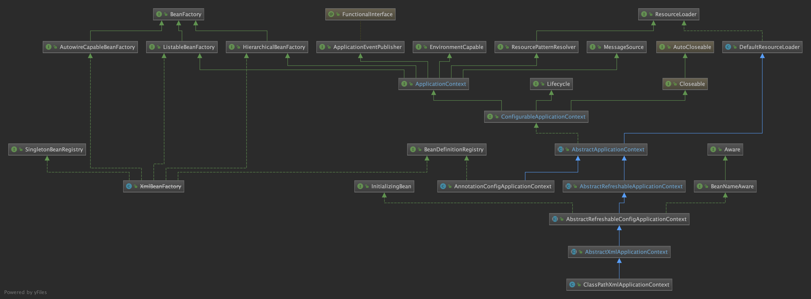
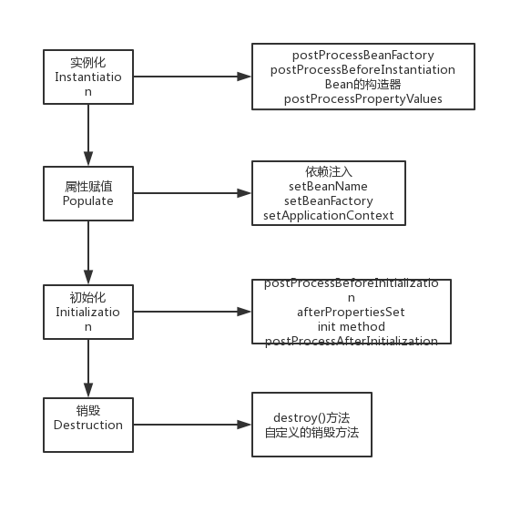

### IoC

IoC即Inversion of Control，是控制反转的意思：所谓IoC，就是由spring IoC容器来负责对象的生命周期和对象之间的关系。
Spring通过一个配置文件描述Bean及Bean之间的关系，利用Java的反射实例化Bean并建立Bean之间的依赖关系。Spring的Ioc容易在完成基础工作上，还提供了Bean实例缓存、生命周期管理、Bean实例化、事件发布、资源装载等服务。

#### IoC容器

对于spring-IoC来说，最重要的就是容器。容器管理着Bean的生命周期，控制着Bean的依赖注入。
spring启动时会读取程序中提供的Bean配置信息，然后在容器中生成一份相应的Bean配置的注册表，根据这份注册表实例化Bean，装配好Bean之间的关系。

#### 主要实现（BeanFactory/ApplicationContext）

BeanFactory是spring框架的基础设施面向spring（低级容器）；ApplicationContext面向spring使用者，提供了更多的功能（高级容器）。

通过常用的ClassPathXmlApplicationContext来展示整个容易的XML类图如上所示，像BeanFactory、HierarchicalBeanFactory、ListableBeanFactory、XMLBeanFactory这些都属于低级容器，ApplicationContext和它的实现都是高级容器。
可以看出ApplicationContext不仅仅实现了BeanFactory的功能，还实现了ResourceLoader、MessageSource、ApplicationEventPublisher、EnvironmentCapable，所以ApplicationContext除了BeanFactory提供的功能以外，还支持：

- 默认初始化所有的Singleton，也可以通过配置取消预初始化。
- 继承MessageSource，因此支持国际化。
= 资源访问，比如访问URL和文件。
= 事件机制。
= 同时加载多个配置文件。
- 以声明式方式启动并创建Spring容器。

所以，可以说ApplicationContext是高级容器，依赖着低级容器的getBean的功能，并提供了更多的额外功能。

下面是一些主要类（低级容器）的功能：

- BeanDefinitionRegistry（注册表）:spring配置文件中每一个节点元素在spring容器中都通过一个BeanDefinition对象表示，它描述了Bean的配置信息。而BeanDefinitionRegistry接口提供了向容器注册BeanDefinition对象的方法。
- BeanFactory（顶层接口）:它最主要的方法就是getBean(String beanName)，该方法从容器中返回特定名称的Bean，BeanFactory的功能通过其他的接口得到不断扩展。
- ListableBeanFactory:该接口提供了访问容器内Bean基本信息的一些方法，如查看Bean的个数、获取某一类型Bean的配置名、查看容器中是否包括某一Bean等方法。
- HierarchicalBeanFactory（父子级联）:子容器可以通过该接口访问父容器；通过HierarchicalBeanFactory，Spring的IoC容器可以建立父子层级关联的容器体系，子容器可以访问父容器中的Bean，但父容器不能访问子容器的Bean。
- ConfigurableBeanFactory: 增强了IoC容器的可定制性，它定义了设置类装载器、属性编辑器、容器初始化后置处理器等方法.
- AutowireCapableBeanFactory（自动装配）:定义了将容器中的Bean按某种规则(如按名字匹配、按类型匹配等)进行自动装配的方法。
- SingletonBeanRegistry:定义了允许在运行期间向容器注册单实例Bean的方法；对于单实例(singleton)的Bean来说，BeanFactory会缓存Bean实例，所以第二次使用getBean()获取Bean时将直接从IoC容器的缓存中获取Bean实例。Spring在DefaultSingletonBeanRegistry类中提供了一个用于缓存单实例Bean的缓存器，它是一个用HashMap实现的缓存器，单实例的Bean以beanName为键保存在这个HashMap中。

#### Spring IoC初始化过程

IoC容器初始化的过程基本如下图：

1. 用户构造 ClassPathXmlApplicationContext。
2. 访问高级容器（AbstractApplicationContext）的refresh方。此方法是模板方法，很多方法都让不同的实现类去实现，obtainFreshBeanFactory创建bean工厂回调低级容器的refreshBeanFactory方法，将所有的BeanDefinition 和 Properties加载到容器中。
3. 低级容器加载后，高级容器会处理一些回调，例如Bean的后置处理器、注册监听器、发布事件、实例化单例Bean等。

容器初始化之后，会使用getBean去获取Bean：

getBean的操作都是在低级容器中进行的。
当Bean_A依赖着Bean_B，而这个Bean_A在加载的时候，其配置的ref="Bean_B"在解析的时候只是一个占位符，被放入了Bean_A的属性集合中，当调用getBean时，需要真正Bean_B注入到Bean_A内部时，就需要从容器中获取这个Bean_B，这里会产生递归。

- 加载所有的Bean包装为BeanDefinition到容器中，如果Bean有依赖关系，则使用占位符先替代。
- 在调用getBean的时候，会进行真正的依赖注入（如果碰到属性是ref的，就从容器中获取这个bean，然后注入到实例中）。

#### Spring Bean的作用域

Spring中Bean定义了5种作用域，分别为singleton（单例）、prototype（原型）、request、session和global session。

1. singleton：单例模式，Spring中默认的作用域，在容器中只会存在一个共享的Bean实例，在多线程的情况下是不安全的。
2. prototype：原型模式，每次通过Spring容器获取prototype定义的bean时，容器都将创建一个新的Bean实例，每个Bean实例都有自己的属性和状态。
3. request：一次request会产生一个实例，在一次Http请求中，容器会返回该Bean的同一实例。而对不同的Http请求则会产生新的Bean，而且该Bean仅在当前Http Request内有效,当前Http请求结束，该Bean实例也将会被销毁。
4. session：在一次Http Session中，容器会返回该Bean的同一实例。
5. global Session：在一个全局的Http Session中，容器会返回该Bean的同一个实例，仅在使用portlet context时有效。

#### Spring Bean的生命周期

Spring Bean的生命周期有四个过程：实例化->属性赋值->初始化->销毁。但是Spring在对Bean管理的过程中，具体化了很多接口，完整的过程如下

- postProcessBeanFactory：BeanFactoryPostProcessor的方法，允许使用者修改容器中的bean definitions，但是不能进行Bean的实例化（会导致依赖注入失败）。
- postProcessBeforeInstantiation：InstantiationAwareBeanPostProcessorAdapter的方法，在Bean实例化之前调用，在Bean的构造函数之前。
- postProcessPropertyValues：在属性中被设置到目标实例之前调用，可以完成对属性的各种操作，注解中元数据的解析。
- setBeanName：如果这个Bean实现BeanNameAware接口，就会调用它的setBeanName方法。
- setBeanFactory：如果这个Bean实现了BeanFactoryAware接口，就会调用它的setBeanFactory(BeanFactory)方法，这个参数传递的是Spring工厂本身。
- setApplicationContext：如果这个Bean实现了ApplicationContext方法，则会调用它的setApplicationContext方法，传入的参数是Spring的上下文。
- postProcessBeforeInitialization：如果这个Bean实现了BeanPostProcessor接口，会调用此方法。
- afterPropertiesSet：InitializingBean的方法（如果实现会调用）。
- init method：如果Bean在配置文件中配置了init-method属性，则会调用这个方法。
- postProcessAfterInitialization：InstantiationAwareBeanPostProcessorAdapter的方法（如果实现会调用）。
- destroy：Bean不在使用时，如果Bean实现了DiposibleBean接口，会执行此方法。
- destroy-method：如果Bean在配置文件中配置了destroy-method属性，则会调用这个方法。

这些过程也可以归为下面四个大过程：

